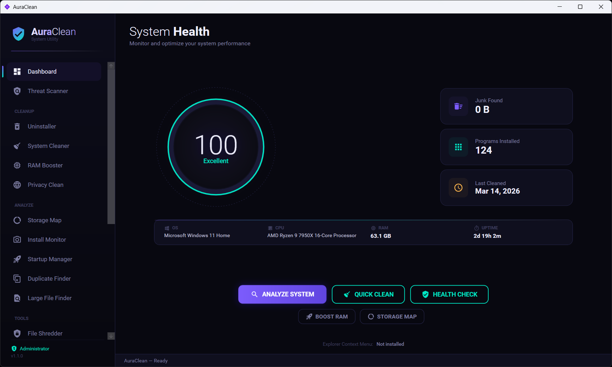
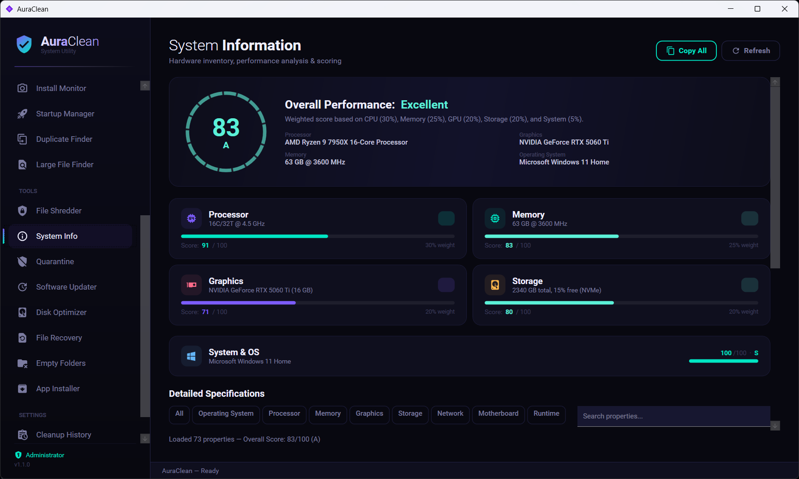

<div align="center">
  

  <h1>AuraClean</h1>

  <p><strong>A modern, all-in-one Windows system utility</strong></p>
  <p>Clean junk · Boost RAM · Scan threats · Manage startups · Shred files · Analyze storage<br/>Built with .NET 8 &amp; WPF — wrapped in a sleek dark UI</p>

  <p>
    
    
    
    
  </p>
</div>

---

## Screenshots

<div align="center">
  
  
</div>

---

## Features

**Cleanup**
- **Uninstaller** — Deep uninstall with orphaned registry & remnant file scanning, force-remove broken MSI entries
- **System Cleaner** — Scans 15 junk categories: temp files, Windows Update cache, prefetch, crash dumps, Recycle Bin, WinSxS, and more
- **RAM Booster** — Trim working sets and purge the standby list using native Windows APIs
- **Privacy Clean** — Clear browser caches, cookies, and tracking data with SQLite VACUUM + DNS flush

**Analyze**
- **Storage Map** — Visual treemap disk analyzer with breadcrumb navigation and top-10 largest files
- **Install Monitor** — Before/after snapshot diffing to see exactly what an installer changed
- **Startup Manager** — View, enable, disable, or remove startup entries from Registry, shell:startup, and Task Scheduler
- **Duplicate Finder** — 3-pass detection: file size → partial hash → full SHA-256
- **Large File Finder** — Find files above a configurable threshold (50 MB – 1 GB), batch delete

**Tools**
- **File Shredder** — Secure multi-pass deletion (Quick Zero, Random, DoD 5220.22-M, Enhanced 7-pass)
- **System Info** — Hardware inventory with weighted performance scoring and letter grades (S–F)
- **Quarantine** — Isolate suspicious files with restore capability and auto-expiry
- **Software Updater** — Check installed programs for available updates
- **Disk Optimizer** — TRIM, defrag, and optimization recommendations for HDD/SSD
- **File Recovery** — Scan and recover recently deleted files
- **Empty Folder Finder** — Detect and remove empty folders and nested empty trees
- **App Installer** — Bundle installer for streamlined application deployment

**Security**
- **Threat Scanner** — Heuristic malware/adware/PUP detection with real-time file, process, startup, service, and hosts-file scanning

---

## Getting Started

### Quick Install

```powershell
git clone https://github.com/ant3869/AuraClean.git
cd AuraClean
powershell -ExecutionPolicy Bypass -File install.ps1
```

The install script handles everything — checks for .NET SDK (installs it if missing), builds a self-contained EXE, places it in `%LocalAppData%\AuraClean`, creates a desktop shortcut, and launches the app.

> AuraClean requires **Administrator privileges** for system-level operations.

### Build from Source

```powershell
# Requires: .NET 8.0 SDK, Windows 10/11 x64

git clone https://github.com/ant3869/AuraClean.git
cd AuraClean

# Using the build helper
.\build.ps1              # Debug build
.\build.ps1 -Release     # Release publish (single-file ~73 MB)
.\build.ps1 -Run         # Build + launch
.\build.ps1 -Clean       # Clean artifacts

# Or standard dotnet commands
dotnet build -c Debug AuraClean/AuraClean.csproj
```

### Publish Portable EXE

```powershell
dotnet publish -c Release AuraClean/AuraClean.csproj
```

Produces a **self-contained single-file executable** (~73 MB). No .NET runtime required on the target machine.

---

## Tech Stack

| | Technology | Purpose |
|---|---|---|
| ⚙️ | [.NET 8.0](https://dotnet.microsoft.com/) | Runtime & SDK |
| 🖼️ | [WPF](https://github.com/dotnet/wpf) | UI framework |
| 🎨 | [MaterialDesign XAML Toolkit](https://github.com/MaterialDesignInXAML/MaterialDesignInXamlToolkit) | UI components & theming |
| 🏗️ | [CommunityToolkit.Mvvm](https://github.com/CommunityToolkit/dotnet) | MVVM source generators |
| 💾 | [System.Data.SQLite](https://www.nuget.org/packages/System.Data.SQLite.Core) | Browser database cleanup |
| 📋 | [TaskScheduler](https://www.nuget.org/packages/TaskScheduler) | Startup & scheduled task management |

---

## How It Works

AuraClean follows the **MVVM** pattern with static async services. Every long-running operation supports progress reporting and cancellation.

Native Windows APIs (P/Invoke) are used where needed:
- `EmptyWorkingSet` / `NtSetSystemInformation` for memory optimization
- `MoveFileEx` for boot-time deletion of locked files
- Restart Manager API for detecting which processes hold file locks
- `GlobalMemoryStatusEx` for accurate memory stats

All user data is stored locally in `%LocalAppData%\AuraClean\` — settings, cleanup history, quarantine, snapshots, and logs.

---

## Security

- Restore points created before destructive operations
- Dry-run mode to preview changes without touching files
- DoD 5220.22-M compliant file shredding
- Quarantine with restore and auto-purge
- WinSxS cleanup uses official DISM commands only
- Requires Administrator privileges by design

---

## License

This project is provided as-is for educational and personal use.
